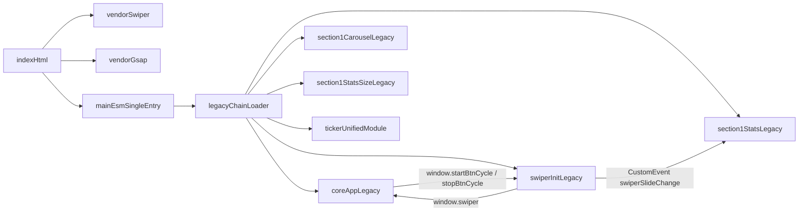

# Runtime Inventory (MP-01...MP-12)

Дата: 2026-03-15

## 1) Фактический runtime bootstrap

### Script order в `index.html`

1. `assets/js/head/theme-color-meta.js`
2. `assets/vendor/swiper/swiper-bundle.min.js`
3. `assets/vendor/gsap/gsap.min.js`
4. `assets/vendor/gsap/ScrollTrigger.min.js`
5. `assets/js/main.js` (`type="module"`) — **single app entry**

### Legacy chain (загружается из `main.js`)

`assets/js/runtime/legacy-chain-loader.js` подгружает в фиксированном порядке:

1. `assets/js/modules/core/app.js`
2. `assets/js/modules/ui/carousel/swiper-init.js`
3. `assets/js/modules/ui/carousel/section1-carousel.js`
4. `assets/js/modules/business/stats/section1-stats.js`
5. `assets/js/modules/business/stats/section1-stats-size.js`
6. `assets/js/modules/utils/ticker/ticker-unified-module.js`

## 2) Active graph (producer/consumer)

## 3) Глобалы: owner/consumer (факт)

| Глобал                     | Producer                                        | Consumer                             |
| -------------------------- | ----------------------------------------------- | ------------------------------------ |
| `window.swiper`            | `modules/ui/carousel/swiper-init.js`            | `modules/core/app.js`                |
| `window.startBtnCycle`     | `modules/core/app.js`                           | `modules/ui/carousel/swiper-init.js` |
| `window.stopBtnCycle`      | `modules/core/app.js`                           | `modules/ui/carousel/swiper-init.js` |
| `window.activateLightning` | `modules/ui/animations/lightning-effect.js`     | нет обязательных consumers           |
| `window.section1Carousel`  | `modules/ui/carousel/section1-carousel.js`      | нет обязательных consumers           |
| `window.__section2Grid`    | `modules/ui/interactions/section2-grid.js`      | нет обязательных consumers           |
| `window.TickerModule`      | `modules/utils/ticker/ticker-unified-module.js` | runtime side-effect                  |

Примечание: `swiperSlideChange` диспатчится в `modules/ui/carousel/swiper-init.js`, слушается в `modules/business/stats/section1-stats.js`.

## 4) Active ESM modules (`main.js`)

`main.js` инициализирует:

- runtime: `context`, `bootstrap`, `reduced-motion-guard`, `swiper-bridge`, `legacy-chain-loader`, `legacy-health-check`
- UI/business ESM:
  - `modules/core/viewport-utils.js`
  - `modules/core/utils/performance.js`
  - `modules/ui/carousel/uii-carousel.js`
  - `modules/ui/animations/lightning-effect.js`
  - `modules/ui/animations/pointer-crosshair.js`
  - `modules/ui/animations/tilt-hover.js`
  - `modules/ui/interactions/section2-grid.js`
  - `modules/business/contracts/collection-cta-position.js`

## 5) Legacy / orphan inventory (актуально)

### Что удалено в MP-03/MP-07

- `assets/js/entry.js`
- `assets/js/main-after-swiper.js`
- `assets/js/modules/app.js`
- `assets/js/modules/core/utils/performance-monitor.js`
- `assets/js/modules/animations/lightning-effect.js`
- `assets/js/modules/animations/pointer-crosshair.js`
- `assets/js/modules/carousel/swiper-init.js`
- `assets/js/modules/utils/ticker/unified-ticker.js`
- пустые директории `assets/js/modules/animations/` и `assets/js/modules/carousel/`

### Оставшиеся потенциально неиспользуемые JS

- `assets/js/modules/blueprints/items/CylindricalPot.js`
- `assets/js/modules/blueprints/items/RoundPot.js`
- `assets/js/modules/blueprints/items/SquarePot.js`
- `assets/js/modules/blueprints/items/TallPot.js`
- `assets/js/modules/blueprints/items/TaperedPot.js`
- `assets/js/modules/business/contracts/contract-cards.js`
- `assets/js/modules/business/contracts/contract-pointer.js`
- `assets/js/modules/business/contracts/contract-section.js`
- `assets/js/modules/business/production-section.js`
- `assets/js/modules/utils/ticker/features-ticker.js`
- `assets/js/modules/utils/ticker/ticker-infinite.js`

## 6) Риски и ограничения

1. `core/app.js` и `swiper-init.js` остаются монолитным legacy-контуром.
2. CSP для `style-src` оставляет `'unsafe-inline'` из-за активного использования `element.style` в legacy.
3. Полная декомпозиция blueprint-подсистемы не выполнена (orphan-файлы в `blueprints/items`).

## 7) Канонические пути

- Runtime entry: `assets/js/main.js`
- Runtime infra: `assets/js/runtime/*`
- UI анимации: `assets/js/modules/ui/animations/`
- UI карусели: `assets/js/modules/ui/carousel/`
- Legacy-frozen chain (через loader):
  - `assets/js/modules/core/app.js`
  - `assets/js/modules/ui/carousel/swiper-init.js`
  - `assets/js/modules/ui/carousel/section1-carousel.js`
  - `assets/js/modules/business/stats/section1-stats.js`
  - `assets/js/modules/business/stats/section1-stats-size.js`
  - `assets/js/modules/utils/ticker/ticker-unified-module.js`
